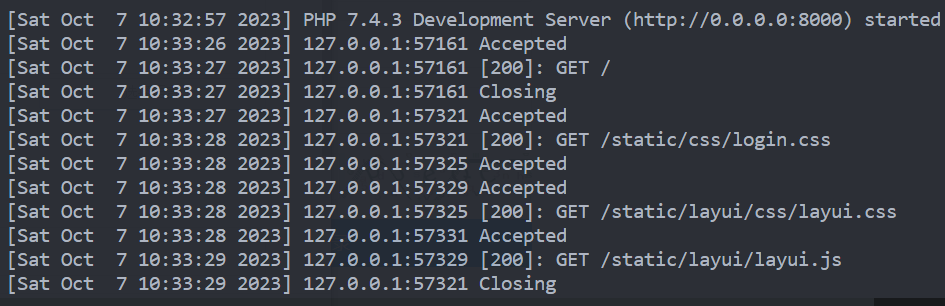
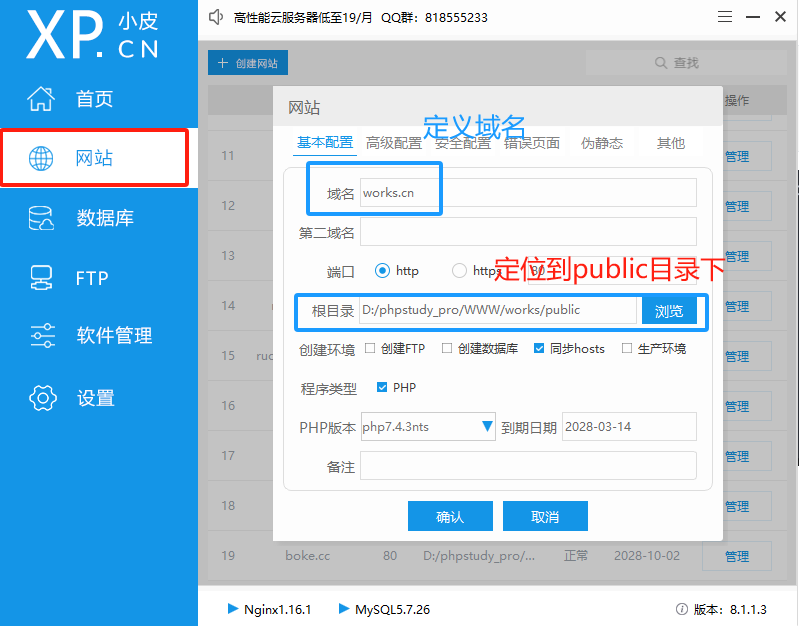

# 智慧作业管理使用手册

> 1. 环境要求：`PHP7.4` `MySQL5.7` `nginx1.6` `composer`
>
>    - 使用 phpstudy 等集成工具可一键部署 PHP、MySQL、nginx
>
>    - composer 安装教程：https://www.runoob.com/w3cnote/composer-install-and-usage.html
>
> 2. 执行下面命令，安装系统
>
>    ```
>    #在任意目录执行克隆git仓库
>    git clone https://github.com/xiaopacairq/works.git
>
>    #在目录下下载资源包，出现vendor表示安装成功
>    composer install
>
>    #导入目录下works.sql文件到MySQL数据库中
>    使用phpmyadmin或者Navicat导入即可
>
>    #配置数据库文件config/database.php
>      'connections'     => [
>            'mysql' => [
>                // 数据库名
>                'database'        => env('database.database', ''),
>                // 用户名
>                'username'        => env('database.username', ''),
>                // 密码
>                'password'        => env('database.password', ''),
>                // 端口
>                'hostport'        => env('database.hostport', '3306'),
>          		....
>            ],
>        ]
>
>    ```
>
> 3. 启动 Web 服务
>
>    ```
>    # 方案一，启动内置服务器
>    #使用ThinkPHP命令行，开启Web服务
>    php think run
>    ```
>
>    
>
>    学生端访问：http://0.0.0.0:8000/www (默认班级编号：2023001 账号：2023001 密码：2023001)
>
>    教师端访问：http://0.0.0.0:8000/houtai (默认 账号：admin 密码：admin )
>
>    方案二：使用 phpstudy、wamp 等集成工具部署
>
>    
>
>    系统使用伪静态隐藏入口文件模式，在 public 目录下
>
>    若是开启`nginx`服务器，则将`nginx.htaccess`代码负责到`phpstudy`的伪静态中
>
>    若启动`Apache`服务器，则将`.htaccess`代码负责到`phpstudy`的伪静态中
>
>    学生端访问：http://works.cn/www (默认班级编号：2023001 账号：2023001 密码：2023001)
>
>    教师端访问：http://works.cn/houtai (默认 账号：admin 密码：admin )

> 访问上述路径后，出现登录页面即部署成功！


若在部署中遇到任何问题，联系我 QQ：2833924820！
